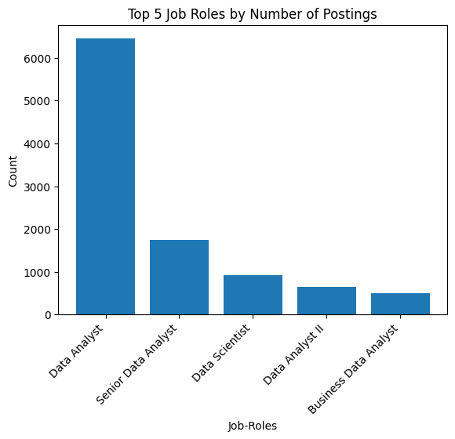
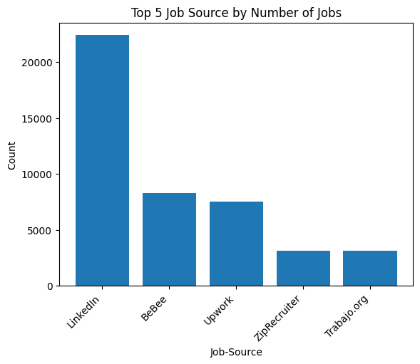
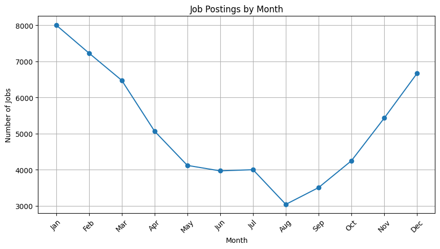

# 📊 Job Market Analytics & Career Insights


<p align="center">
  <strong>Turning Job Posting Data into Career Insights</strong>
</p>

<p align="center">
  
  
  
  
</p>

---

## 🧭 Quick Navigation

**[📌 Overview](#-project-overview)** •
**[🎯 Objectives](#-objectives)** •
**[🔄 Workflow](#-project-workflow)** •
**[📊 Analysis](#-analysis)** •
**[🛠️ Technologies](#️-technologies)** •
**[🚀 Future Scope](#-future-scope)**

---

## 📌 Project Overview

**Job Market Analytics & Career Insights** is a data analytics project
designed to explore job-posting data and identify meaningful patterns
in the job market.

The project focuses on:

- 📈 Job demand
- 💰 Salary patterns
- 🌍 Locations
- 🏢 Companies
- 🏠 Remote opportunities
- ⏰ Job schedules
- 🔎 Job sources
- 📅 Job-posting trends

---

## 🎯 Objectives

| Objective | Description |
|---|---|
| 📈 Demand Analysis | Identify frequently posted job roles |
| 💰 Salary Analysis | Compare salary patterns |
| 🌍 Location Analysis | Identify major job locations |
| 🏢 Company Analysis | Analyze hiring activity |
| 🏠 Remote Analysis | Examine remote opportunities |
| 📅 Trend Analysis | Study job-posting trends |
| 🗄️ SQL Analysis | Query and aggregate job data |

---

## 🔄 Project Workflow

```text
             📁 Raw Dataset
                   ↓
             🔍 Data Review
                   ↓
             🧹 Data Cleaning
                   ↓
             📊 EDA
                   ↓
             🗄️ SQL Analysis
                   ↓
             💡 Key Insights
                   ↓
          🚀 Streamlit Dashboard

📊 Analysis
🔥 Job Demand

Analysis of the most frequently occurring job roles.

🌍 Job Locations

Identification of locations with the highest number of postings.

💰 Salary Analysis

Comparison of average annual salaries across job roles.

🏢 Company Analysis

Identification of companies with higher numbers of job postings.

🏠 Remote Work

Analysis of remote and non-remote opportunities.

📅 Job Trends

Analysis of job-posting activity over time.

```
<p align="center">   </p> <p align="center">  </p>


👨‍💻 Project Information

Project: Job Market Analytics & Career Insights
Domain: Data Analytics
Language: Python
Status: 🚧 Development
